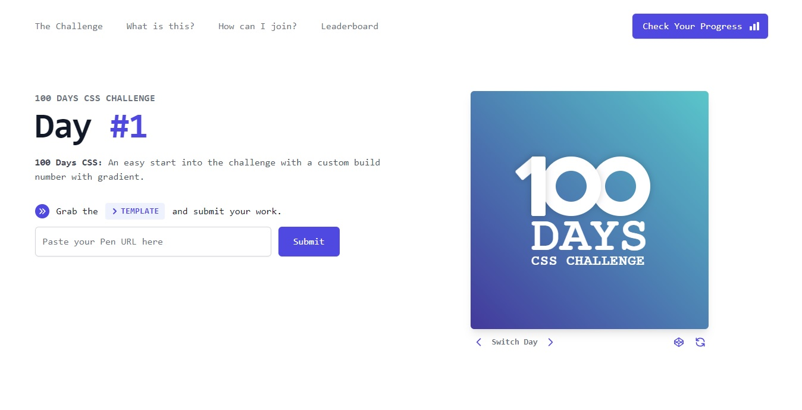
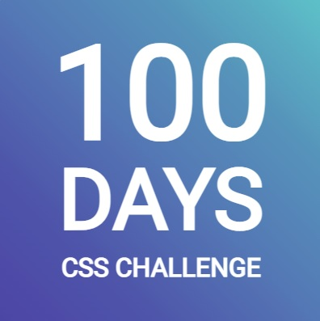

<h1 align="center">100 days css challenge ✌️</h1>

 

<h1>Day 1 - Simple gradient with centered text</h1>

  

  Can be found on: 
  <b>
    <a href="https://100dayscss.com">https://100dayscss.com</a>
  </b>

  Challenge made by 
  <b>
    <a href="https://codepen.io/roydigerhund">Mathias Martin</a>.
  </b>

